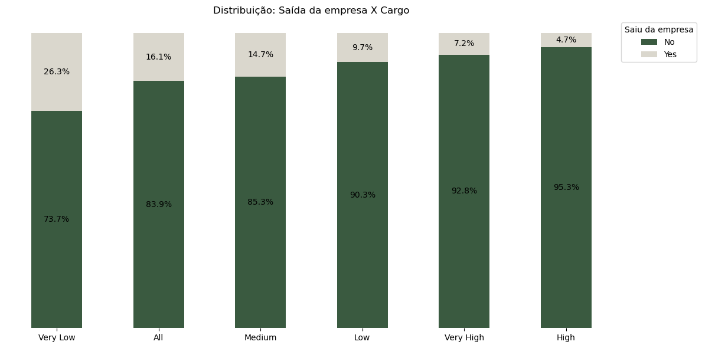
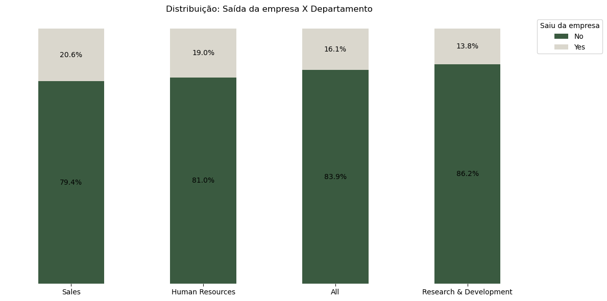
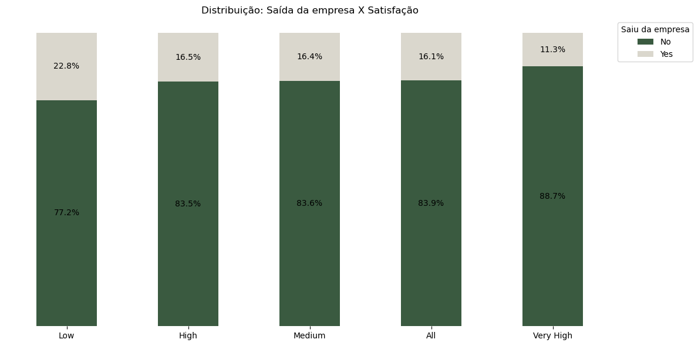
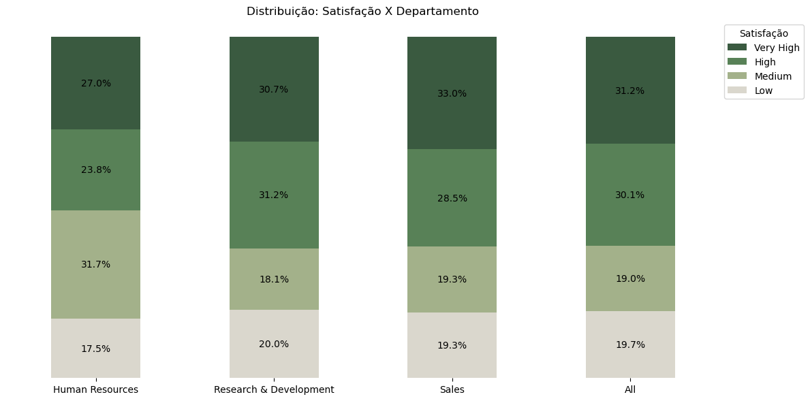
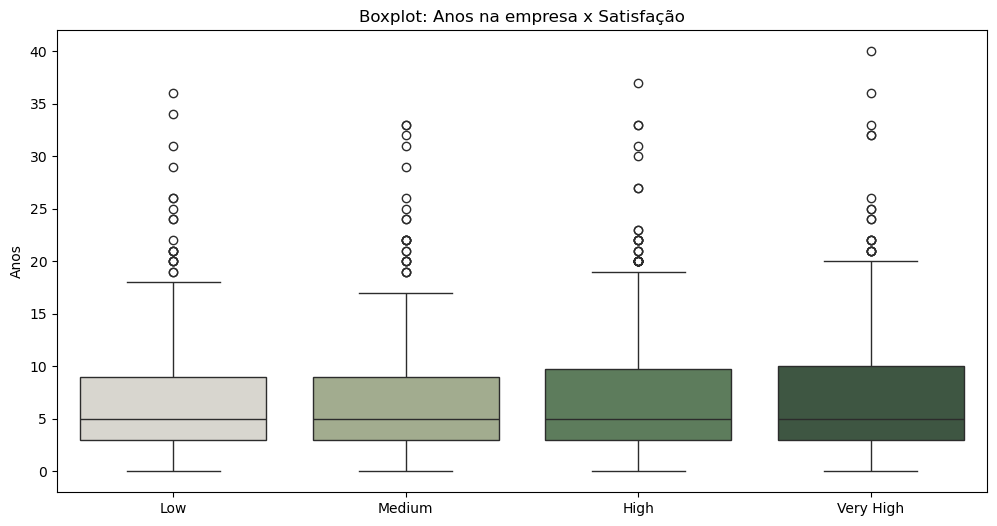

# **Análise da satisfação e saídas de funcionários de uma empresa**

### Resumo

Este projeto analisou dados de satisfação e saída de funcionários de uma empresa a pedido do time de Recursos Humanos. O objetivo da análise foi verificar a relação de fatores como o nível salarial, o departamento e o tempo de casa com a satisfação e saída de funcionários da empresa. Com base na análise exploratória e estatística dos dados, foi possível prover informações para subsidiar ações do RH visando promover o aumento global da satisfação dos funcionários, investigação de fatores relacionados à saída de funcionários nos departamentos de Sales e RH, e incentivo à retenção de talentos em cargos iniciais.

A análise realizada permitiu identificar que existe associação entre a perda de talentos e o departamento do qual eles fazem parte; que o padrão de satisfação de quem sai da empresa é diferente dos que ficam; que o nível salarial está associado à retenção de talentos; que a satisfação não está relacionada ao departamento do funcionário e nem ao tempo de permanência na empresa. Esses achados permitiram o direcionamento de ações aos fatores que realmente impactam na satisfação e saída de talentos.

Os produtos da análise foram uma apresentação de negócios com os principais insights obtidos e um notebook comentado em Python contendo toda a análise exploratória e estatística realizada.

[Apresentação - Análise funcionários](LINK)

Leia mais sobre o projeto abaixo.

### Índice

- [1. Contexto](LINK)
- [2. Premissas assumidas para a análise](LINK)
- [3. Ferramentas utilizadas](LINK)
- [4. Estratégias de solução](LINK)
- [5. O produto final do projeto](LINK)
- [6. Principais insights de dados](LINK)
- [7. Conclusão](LINK)
- [8. Próximos passos](LINK)

### 1. Contexto

O time de Recursos Humanos de uma empresa de tecnologia quer realizar ações de retenção de talentos e melhorias internas, pois acredita que fatores como nível salarial, departamento e tempo de casa possam influenciar a satisfação com a empresa e a saída de funcionários. Para essa análise, foram disponibilizados dados de satisfação dos funcionários, saídas da empresa, salário, cargo e tempo de permanência.

**Objetivos da análise:**

Os objetivos da análise são realizar as seguintes verificações para que possam ser detectados padrões relacionados à saída e satisfação com a empresa:
- Existe associação entre o nível salarial do funcionário e a intenção de sair da empresa?
- Algum departamento tem maior risco de perda de talentos?
- O padrão de satisfação difere entre quem ficou e quem saiu da empresa?
- A satisfação difere entre departamentos?
- O tempo de casa influencia a satisfação?

Para atingir os objetivos pretendidos, realizou-se uma análise exploratória de dados seguida de uma análise estatística. Com base nos resultados, foram recomendadas ações ao RH.

Utilizou-se Python para tratamento e análise dos dados.

Os principais insights obtidos foram inseridos em uma apresentação de negócios.

### 2.  Premissas assumidas para a análise

1. As saídas dos funcionários se tratam de saídas voluntárias (pedidos de demissão).
2. Os dados utilizados foram obtidos no EBA: https://renatabiaggi.com/eba-estatistica/
3. A imagem utilizada no portfólio foi retirada de: https://storyset.com/

### 3. Ferramentas utilizadas

- Python para a EDA e análise estatística:
    - Pandas
    - Numpy
    - Seaborn
    - Matplotlib
    - Scipy
    - Statsmodels
- Canva para a apresentação

### 4. Estratégias de solução

O projeto foi desenvolvido por meio de análises estatísticas, considerando-se as seguintes etapas:

1. Análise exploratória dos dados:
   
    Nessa etapa, os dados foram explorados a fim de entender os tipos de variável, investigar valores únicos, verificar valores ausentes ou nulos, verificar a qualidade dos dados (por exemplo: escrita inconsistente, zeros onde não deveriam existir, unidades inconsistentes) e analisar a distribuição de variáveis categóricas e numéricas.

1. Teste de hipóteses para a associação entre o nível salarial e a saída da empresa:
    
    Nessa etapa, foi aplicado um teste qui-quadrado de independência para variáveis nominais com mais de uma categoria.
   
2. Teste de hipóteses para a associação entre o departamento e a saída da empresa:
    
    Nessa etapa, foi aplicado um teste qui-quadrado de independência para variáveis nominais com mais de uma categoria.

3. Teste de hipóteses para o padrão de satisfação entre quem ficou e quem saiu da empresa:

     Teste de Mann-Whitney para tendência central de duas amostras.

4. Teste de hipóteses para o padrão de satisfação entre departamentos:

     Teste de Kruskal-Wallis para tendência central de três amostras.

5. Teste de hipóteses para correlação entre a satisfação e o tempo de casa:

     Teste de correlação de Spearman.

### 5. O produto final do projeto

Apresentação de negócios com os principais insights e recomendações a respeito da análise de satisfação e saída dos funcionários. Notebook com a análise completa dos dados.
        
1. [Apresentação - Análise funcionários](LINK).
    
2. [Notebook](satisfacao_saidas_funcionarios.ipynb) contendo a análise completa dos dados.

### 6. Principais insights de dados

**Existe associação entre o nível salarial do funcionário e a intenção de sair da empresa?**

O teste de associação qui-quadrado comprovou que existe associação entre o nível do cargo (proxy para nível salarial) e a saída da empresa. Cargos de nível mais baixo possuem maiores percentuais de saída de funcionários (26,3%).

**Algum departamento tem maior risco de perda de talentos?**

O teste de associação qui-quadrado comprovou que existe associação entre o departamento e a saída da empresa. Os departamentos de Sales e Human Resources possuem os maiores percentuais de saída (6,8 e 5,2 pontos percentuais, respectivamente, acima do percentual de saída do departamento de Research & Development).

**O padrão de satisfação difere entre quem ficou e quem saiu da empresa?**

O teste de Mann-Whitney comprovou que o padrão de satisfação de quem sai da empresa é diferente do que de quem fica. Funcionários com baixa satisfação saem mais.

**A satisfação difere entre departamentos?**

O teste de Kruskal-Wallis comprovou não haver evidências estatísticas de que o padrão de satisfação é diferente entre departamentos. Sales tem o maior percentual de satisfação "muito alta" (33,0%), único departamento acima do percentual geral da empresa (31,2%). Apesar disso, possui o maior percentual de saídas, o que indica que há outras motivações para as saídas além da satisfação.

**O tempo de casa influencia a satisfação?**

O teste de correlação de Spearman comprovou não haver evidências estatísticas de correlação entre o tempo de permanência na empresa e a satisfação.

Recomendações baseadas nos insights obtidos se encontram na Conclusão abaixo.

### 7. Conclusão

A análise dos dados permitiu a detecção de padrões referentes aos funcionários que saíram da empresa e à satisfação. Com isso, foram recomendadas algumas ações para aumentar a retenção e satisfação dos colaboradores.

**Perfil geral da empresa:**
- **Distribuição dos funcionários:** O departamento com maior número de funcionários é o Research & Development. A distribuição de cargos diminui à medida que o nível do cargo aumenta, conforme o esperado em empresas. Metade dos funcionários estão ou estiveram na empresa por até 5 anos.
- **Satisfação:** De forma geral, a maioria dos funcionários possui satisfação alta ou muito alta com a empresa (> 60% dos funcionários).
- **Retenção de talentos:** A maioria dos funcionários (> 80%) permanece na empresa.

**Perda de talentos:**
- **Associação com o departamento:** O teste de associação qui-quadrado comprovou que existe associação entre o departamento e a saída da empresa. Os departamentos de Sales e Human Resources possuem os maiores percentuais de saída (6,8 e 5,2 pontos percentuais, respectivamente, acima do percentual de saída do departamento de Research & Development). 
- **Influência da satisfação:** O teste de Mann-Whitney comprovou que o padrão de satisfação de quem sai da empresa é diferente do que de quem fica. Funcionários com baixa satisfação saem mais.
- **Dificuldade de retenção nos cargos iniciais:** O teste de associação qui-quadrado comprovou que existe associação entre o nível do cargo (proxy para nível salarial) e a saída da empresa. Cargos de nível mais baixo possuem maiores percentuais de saída de funcionários (26,3%).
- **Tempo de casa:** Os que saíram ficaram, em média, menos tempo na empresa. Metade dos que saíram o fizeram com até 3 anos de empresa, enquanto metade dos que ficaram, já tem até 6 anos.

**Satisfação com a empresa:**
- **Satisfação por departamento:** O teste de Kruskal-Wallis comprovou não haver evidências estatísticas de que o padrão de satisfação é diferente entre departamentos. Sales tem o maior percentual de satisfação "muito alta" (33,0%), único departamento acima do percentual geral da empresa (31,2%). Apesar disso, possui o maior percentual de saídas, o que indica que há outras motivações para as saídas além da satisfação.
- **Satisfação por cargo:** Cargos de nível médio possuem maior percentual de baixa satisfação com a empresa. Os cargos que possuem maiores níveis de satisfação são os de nível baixo e muito alto.
- **Tempo de casa não incluencia:** O teste de correlação de Spearman comprovou não haver evidências estatísticas de correlação entre o tempo de permanência na empresa e a satisfação. 

**Recomendações:**

Além de ações gerais como o monitoramento contínuo dos níveis de satisfação e saída, e a implementação de canais anônimos de sugestões, elogios e reclamações, recomenda-se:

- **Analisar** formas de aumentar a satisfação de forma geral (em vez de ações focadas em departamentos específicos ou por tempo de permanência), pois a satisfação influencia a retenção de forma global e não há diferenças significativas entre departamentos ou correlação com o tempo de casa:

Ações sugeridas:

1. Realizar um diagnóstico do clima organizacional por meio de pesquisas internas para entender os fatores de insatisfação;
2. Avaliar processos internos como carga de trabalho, reconhecimento, oportunidades de crescimento e planos de carreira;
3. Estudar a implementação de programas de engajamento contínuos para todos;
4. Implementar pesquisas de pulso frequentes para capturar quedas de satisfação antes da saída.

- **Investigar** motivos que possam estar influenciando as saídas no departamento de Sales:

Ações sugeridas:

1. Analisar fatores além da satisfação, como metas agressivas, pressão por resultados, remuneração variável ou falta de suporte;
2. Avaliar ajuste de metas e incentivos;
3. Estudar a implementação de programas de suporte para lidar com estresse da área comercial.

- **Investigar** motivos que possam estar influenciando as saídas no departamento de Human Resources:

Ações sugeridas:

1. Analisar fatores além da satisfação, como cultura, carga de trabalho e liderança;
2. Avaliar ajuste de metas e incentivos.

- **Realizar** ações para aumentar a retenção de talentos em cargos iniciais:

Ações sugeridas:

1. Implementar plano de carreira claro e programas de desenvolvimento desde o início;
2. Implementar processo de onboarding para que novos funcionários se sintam mais preparados;
3. Realizar acompanhamento por meio de check-ins regulares nos primeiros anos na empresa (período crítico de saída: primeiros 3 anos);
4. Revisar políticas salariais (incentivos, bônus ou reajustes).

As ações descritas acima são prioritárias e baseadas nos resultados da análise exploratória e estatística dos dados. São consideradas prioritárias devido à verificação das hipóteses por meio de testes estatísticos.

A seguir, sugere-se também ações não prioritárias baseadas na análise exploratória dos dados:

- **Realizar** ações para aumentar a satisfação de talentos em cargos de nível médio:

Ações sugeridas:

1. Verificar se há sobrecarga ou falta de reconhecimento;
2. Capacitar as lideranças intermediárias para melhor gestão das equipes e conflitos;
3. Oferecer feedbacks e reconhecimento contínuo aos profissionais de cargos intermediários.

- **Realizar** ações para aumentar o tempo de retenção dos funcionários na empresa:

Ações sugeridas:

1. Implementar programa de retenção focado em engajamento, desenvolvimento e cultura organizacional nos primeiros anos do funcionário na empresa;
2. Entender as expectativas dos novos funcionários em relação à empresa e avaliar o que deve ser alinhado à realidade e o que pode ser oferecido pela empresa aos funcionários.

A análise realizada permite que time de RH entenda os fatores que influenciam a saída e satisfação dos funcionários. Consequentemente, conduzindo o time à adoção de medidas mais acertadas e direcionadas aos fatores de fato associados à saída de funcionários e satisfação com a empresa. 

### 7. Próximos passos

Para complementar a análise realizada, os próximos passos incluem a análise estatística dos fatores:
- Diferença entre o tempo médio de permanência na empresa do grupo que saiu e do que ficou para verificar se os que saem ficam, em média, menos tempo na empresa. Caso comprovada a diferença estatística, os resultados podem ser úteis para direcionar ações relacionadas ao aumento da permancência dos talentos.
- A diferença no padrão de satisfação entre os níveis salariais para verificar se os mais insatisfeitos ocupam os menores cargos. Caso comprovada a diferença estatística, essa análise poderia direcionar ações relacionadas ao aumento da satisfação em cargos mais baixos.
